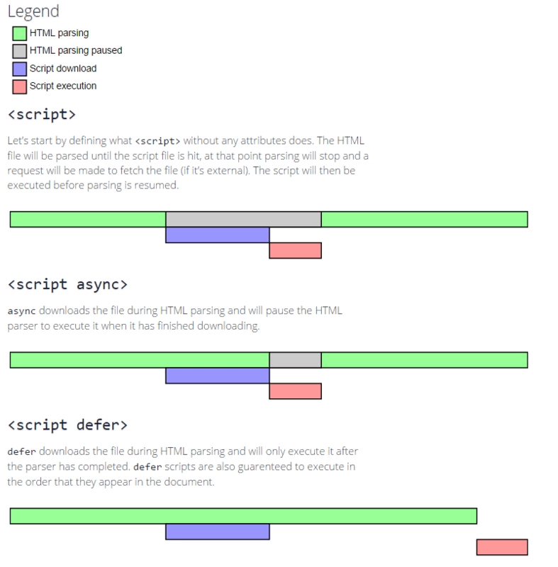

# script标签的async和deffer

### 不加async和deffer
由于渲染线程和js引擎线程是互斥的，所以当渲染线程解析到script标签时，则会交出控制权。开始下载资源，然后执行js。js执行完毕后控制权回到渲染线程，继续解析html。因此下载过程和执行过程都会阻塞渲染

### script async
渲染线程遇上script async标签时，会立即异步下载，下载完之后立即执行。无法保证脚本的执行顺序。用于无依赖的脚本，比如埋点。因此下载过程不会阻塞渲染，执行过程会阻塞渲染

### script deffer
渲染线程遇上script deffer标签时，会立即异步下载，下载完成之后等待页面渲染完毕，在DOMContentLoaded事件之前执行，执行顺序则按照脚本的出现先后顺序。因此整体过程都没有阻塞渲染（执行是在渲染完成之后进行的）

|----|script down|script execution|
| -------------|:-------------:| ------:|
|script|渲染暂停|渲染暂停|
|script async|不阻塞渲染|立即执行，渲染暂停|
|script deffer|不阻塞渲染|渲染完毕后执行|

