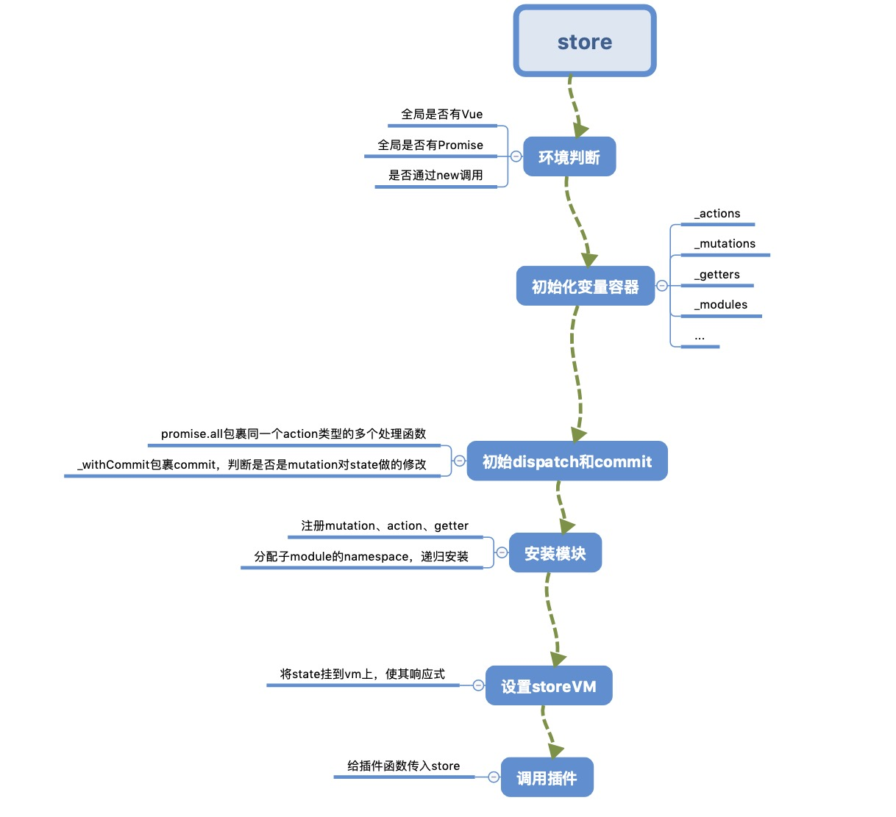

# vuex

## 抛出问题
* vuex如何实现vue组件中注入$store
* vuex如何针对非通过commit mutation修改state的操作发出警告的
* 如何支持模块配置和模块嵌套
* vuex devtools时光旅行功能如何实现

## 安装
vuex如何安装？
```javascript
Vue.use(vuex)

new Vue({
  el: '#app',
  store,
  ...
})
```
Vue.use方法内部调用插件的install方法来安装插件。vuex的install实现
```javascript
function applyMixin(Vue) {
  const version = Number(Vue.version.split('.')[0])

  if (version >= 2) {
    const usesInit = Vue.config._lifecycleHooks.indexOf('init') > -1
    Vue.mixin(usesInit ? { init: vuexInit } : { beforeCreate: vuexInit })
  } else {
    const _init = Vue.prototype._init
    Vue.prototype._init = function (options = {}) {
      options.init = options.init
        ? [vuexInit].concat(options.init)
        : vuexInit
      _init.call(this, options)
    }
  }
}
```
在vuex的install方法中国调用applyMixin。在applyMixin中，通过Vue.mixin将vuexInit方法混入到beforeCreate钩子中。
那么看下vuexInit中具体如何在vue组件树中注入$store对象的
```javascript
function vuexInit () {
  const options = this.$options
  // store injection
  if (options.store) { // 只有根节点有store对象
    this.$store = options.store
  } else if (options.parent && options.parent.$store) { // 子节点都从parent.$store取得store对象
    this.$store = options.parent.$store
  }
}
```

## Vuex.store解析
我们来看看store的constructor中具体干了什么。
### 环境判断
```javascript
if (process.env.NODE_ENV !== 'production') {
  assert(Vue, `must call Vue.use(Vuex) before creating a store instance.`) // 判断是否已经有了全局Vue变量
  assert(typeof Promise !== 'undefined', `vuex requires a Promise polyfill in this browser.`) // 判断是否支持了promise
  assert(this instanceof Store, `Store must be called with the new operator.`) // 判断是否是通过new调用的构造函数
}
```
### 初始化相关变量容器
```javascript
  this._committing = false // 判断是否是通过mutation修改state的变量
  this._actions = Object.create(null) // action容器
  this._mutations = Object.create(null) // mutation容器
  this._wrappedGetters = Object.create(null) // getter容器
  this._modules = new ModuleCollection(options) // module容器
  this._modulesNamespaceMap = Object.create(null) // module和命名空间映射
  this._subscribers = [] // 订阅函数容器
  this._watcherVM = new Vue() // vue实例，使用它的$watch方法
```

### 初始化dispatch和commit
```javascript
this.dispatch = function boundDispatch (type, payload) {
  return dispatch.call(store, type, payload)
}
this.commit = function boundCommit (type, payload, options) {
  return commit.call(store, type, payload, options)
}

// dispatch
dispatch (_type, _payload) {
  const {
      type,
      payload
  } = unifyObjectStyle(_type, _payload)

  const entry = this._actions[type]
  if (!entry) {
    console.error(`[vuex] unknown action type: ${type}`)
    return
  }
  return entry.length > 1
      ? Promise.all(entry.map(handler => handler(payload))) // 如果action对用多个处理函数，则使用Promise.all包裹
      : entry[0](payload)
}

// commit
commit (_type, _payload, _options) {
  const {
      type,
      payload,
      options
  } = unifyObjectStyle(_type, _payload, _options)

  const mutation = { type, payload }
  const entry = this._mutations[type]
  if (!entry) {
    console.error(`[vuex] unknown mutation type: ${type}`)
    return
  }
  // _withCommit包裹commit，用于修改this._committing
  this._withCommit(() => {
    entry.forEach(function commitIterator (handler) {
      handler(payload)
    })
  })
  
  this._subscribers.forEach(sub => sub(mutation, this.state)) // 调用订阅者

  if (options && options.silent) {
    console.warn(
        `[vuex] mutation type: ${type}. Silent option has been removed. ` +
        'Use the filter functionality in the vue-devtools'
    )
  }
}
```
这一步主要是通过call方法绑定给dispatch和commit绑定this为store
**注意：** 如果action对用多个处理函数，则使用Promise.all包裹

### 安装模块
```javascript
installModule(this, state, [], this._modules.root) // 第一次调用时入参module为this._modules.root

function installModule (store, rootState, path, module, hot) {
  // path长度为0表示是rootModule
  const isRoot = !path.length 
  const namespace = store._modules.getNamespace(path) // _modules是ModuleCollection集合，获取module的namespace

  if (module.namespaced) {
    store._modulesNamespaceMap[namespace] = module
  }

  // 将子module.state设置到父module.moduleName属性下
  if (!isRoot && !hot) {
    /* 获取父级的state */
    const parentState = getNestedState(rootState, path.slice(0, -1))
    const moduleName = path[path.length - 1]
    store.`_withCommit`(() => {
      Vue.set(parentState, moduleName, module.state) // 切将子module设置成响应式的
    })
  }

  const local = module.context = makeLocalContext(store, namespace, path)

  /* 遍历注册mutation */
  module.forEachMutation((mutation, key) => {
    const namespacedType = namespace + key
    registerMutation(store, namespacedType, mutation, local)
  })

  /* 遍历注册action */
  module.forEachAction((action, key) => {
    const namespacedType = namespace + key
    registerAction(store, namespacedType, action, local)
  })

  /* 遍历注册getter */
  module.forEachGetter((getter, key) => {
    const namespacedType = namespace + key
    registerGetter(store, namespacedType, getter, local)
  })

  /* 递归安装mudule */
  module.forEachChild((child, key) => {
    installModule(store, rootState, path.concat(key), child, hot)
  })
}
```
安装模块这一步主要完成安装根模块、注册对应的mutations、actions的处理以及getters，然后为每个子module加上namespace，并且递归给每个子模块进行安装

### 设置store._vm
```javascript
resetStoreVM(this, state)

function resetStoreVM (store, state) {
  const oldVm = store._vm // 缓存前vm组件

  // bind store public getters
  store.getters = {}
  const wrappedGetters = store._wrappedGetters
  const computed = {}
  
  // 将getters都存放到computed对象，用于传入vm。再通过Object.defineProperty使得访问store.getter.a获取的是store._vm.a.而_vm.a则是在下面new Vue()时传入的computed
  forEachValue(wrappedGetters, (fn, key) => {
    // use computed to leverage its lazy-caching mechanism
    computed[key] = () => fn(store)
    Object.defineProperty(store.getters, key, {
      get: () => store._vm[key],
      enumerable: true // for local getters
    })
  })

  // use a Vue instance to store the state tree
  // suppress warnings just in case the user has added
  // some funky global mixins
  const silent = Vue.config.silent
  
  // 暂时将Vue设为静默模式，避免报出警告
  Vue.config.silent = true   
  // 设置新的storeVm，state为传入的state，computed为刚刚通过wrappedGetters遍历生成的
  store._vm = new Vue({
    data: { state },
    computed
  })
  
  Vue.config.silent = silent

  // enable strict mode for new vm
  if (store.strict) {
    // 通过$watch监听store的改变，以便咋严格模式下做出警告
    enableStrictMode(store)
  }
  
  if (oldVm) {
    // dispatch changes in all subscribed watchers
    // to force getter re-evaluation.
    store._withCommit(() => {
      oldVm.state = null
    })
    Vue.nextTick(() => oldVm.$destroy())
  }
}
```

### 严格模式下发出警告
```javascript
function enableStrictMode (store) {
  store._vm.$watch('state', () => {
    assert(store._committing, `Do not mutate vuex store state outside mutation handlers.`)
  }, { deep: true, sync: true })
}
```
这里有个_committing变量，前面提高commit的实现经过了_withCommit包裹。看看这个方法的实现
```javascript
_withCommit (fn) {
  const committing = this._committing
  this._committing = true
  fn()
  this._committing = committing
}
```
所以vuex就是通过在commit前修改this_committing，然后监听到state变化时，就可以根据commtting来判断是否是mutation做出的修改了

### 调用插件
```javascript
 // apply plugins
plugins.forEach(plugin => plugin(this))
```
最后一步循环调用插件，给插件方法传入store

回头再看整体流程，如下图：


