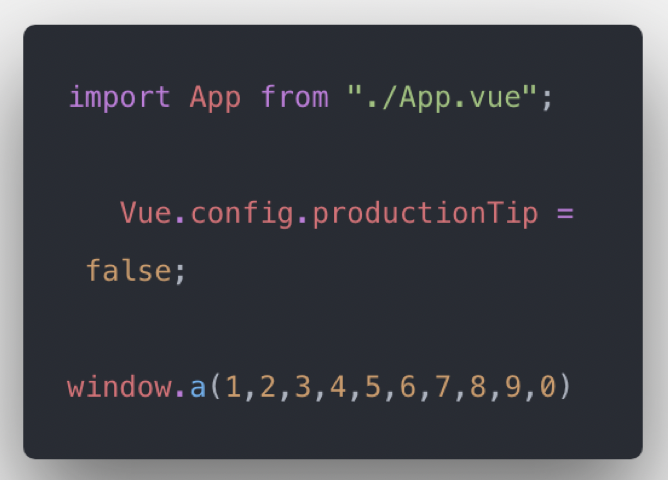
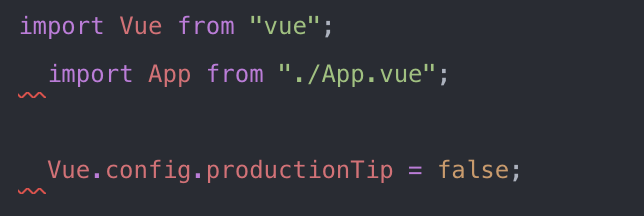

# 代码规范之vscode搭配linter&prettier
#blog/工程

Linter能对你的代码进行质量检查，格式化的功能比较有限。例如代码里有多余空格并不是lint error，因此也不会进行`eslint —fix`来修复。而[prettier](https://prettier.io/)意为更美丽，是一个代码格式化工具，能很好地弥补`linter`对`code formmat`的不足。结合linter和prettier，检测代码中的潜在问题，统一代码规范，助力写出高质量代码，提高工作效率。

### prettier integrating with eslint
假如你的项目没有使用eslint来对代码做质量检查，那按照如下几步也可以轻松在项目添加eslint
* 安装eslint
```bash
npm i eslint -D
eslint --init
```

安装完eslint之后，会在项目根目录下生成一个.eslintrc文件用于配置eslint的规则。
* 使用eslint
在package.json里面配置
```json
"script": {
	"lint": "eslint src/**/* --fix"
}
```
执行`npm run lint`即可检查代码质量，并进行修复。
* vscode实时格式化
虽然上述命令能够对代码进行格式化，但是作为开发人员还是希望能够直接在编辑器里面实时看到错误标注并在保存的时候进行修复。

首先在`vscode`中装一个插件`eslint`
安装好之后打开一个js文件，便可以看到该文件代码里面有问题的地方已经可以看到红色的错误标注。但是发现vue文件仍然没有显示错误。
不要紧，在项目根目录新建文件`.vscode/setting.json`并添加如下配置：
```json
{ 
	"eslint.autoFixOnSave": true,
	"eslint.validate": [
   	"javascript",
    	// jsx
    	"javascriptreact",
    	// vue
    	{
      	"language": "vue",
      	"autoFix": true
    	},
    	// ts
    	{
      	"language": "typescript",
      	"autoFix": true
    	},
    	// tsx
    	{
      	"language": "typescriptreact",
      	"autoFix": true
    	},
    	"html"
  ]
}
```
再次回去查看刚刚的vue文件，发现已经有红色标注了。保存一下，代码自动进行修复。
* 集成prettier
经过以上几个步骤，代码质量已经比较可靠了。但是文件里面多余的空格，函数入参后的空格等格式却没有被当做lint error。如下图


此时prettier的特长就可以派上用场了。

首先安装`eslint-plugin-prettier eslint-config-prettier`
`Eslint-plugin-prettier`用于集成prettier，而`eslint-config-prettier`需要放到extends配置项数组最后一项，用来关闭eslint中和prettier冲突的rule

在eslintrc中添加如下配置
```json
{
	"plugins": ["prettier"],
	"extends": [
    "plugin:vue/essential",
    "eslint:recommended",
    "eslint-config-prettier"
  ],
	"rules": {
      "prettier/prettier": "error"
    }
}
```

此时再看刚刚的代码，如图：


刚刚的空格等格式问题就已经有了错误标注，保存一下自动修复。

至此，代码质量和格式都已经比较规范统一了。但是prettier对vue单文件中的template支持不太好。此时开启vscode的格式化功能。可以装一些其他格式化插件来增强vscode的格式化能力，例如vetur。在`.vscode/setting.json`中设置`”editor.formatOnSave”: true`及时格式化。

### prettier integrating with tslint
其他lint的集成步骤跟eslint同理。
* 安装配置tslint
```bash
npm i tslint -D
tslint --init
```
* 使用tslint进行修复
在package.json中进行如下配置：
```json
"scripts": {
	"lint": "tslint src/**/*.ts --fix"
}
```
* 在vscode中使用tslint

此时需要安装两个个vscode插件`TSLint TSLint Vue`
安装好之后，便可以在vscode中看到代码里的错误标注

在`.vscode/setting.json`中添加如下配置：
```json
"tslint.autoFixOnSave": true
```
保存时对代码进行修复。
* 集成prettier
与Eslint同理，集成prettier来对`code format`进行加强。

首先安装`tslint-plugin-prettier`和`tslint-config-prettier`

在tslint.json中添加如下配置
```json
{
  "extends": ["tslint-plugin-prettier", "tslint-config-prettier"],
  "rules": {
    "prettier": true
  }
}
```

完成以上步骤后，保存时即可对ts代码质量和格式进行较好的统一。

### 参考链接
[Integrating with Linters · Prettier](https://prettier.io/docs/en/eslint.html)
