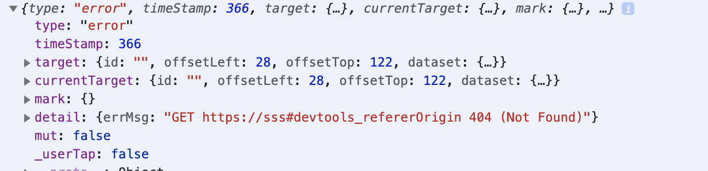
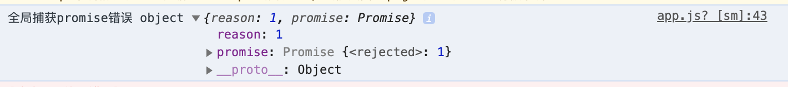

# 小程序错误监控
## JS错误

通过`App`的`onError`属性监听全局JS错误。

#### onError(String error)

小程序发生脚本错误或 API 调用报错时触发。也可以使用 [wx.onError](https://developers.weixin.qq.com/miniprogram/dev/api/base/app/app-event/wx.onError.html) 绑定监听。

**参数**：与 [wx.onError](https://developers.weixin.qq.com/miniprogram/dev/api/base/app/app-event/wx.onError.html) 一致

- 和web端window.onError不一样的地方

|               | window.onError      | App({onError})                                               |
| ------------- | ------------------- | ------------------------------------------------------------ |
| 回调的形参err | 形参是一个Error实例 | 形参是e.stack字符串。例如：string MiniProgramErrorthis.hah is not a functionTypeError: this.hah is not a function   at ge.clickJsBtn (http://127.0.0.1:25208/appservice/pages/sdk/sdk.js:11:10)   at Object.n.safeCallback (http://127.0.0.1:25208/appservice/__dev__/WAService.js:2:3057410)   at http://127.0.0.1:25208/appservice/__dev__/WAService.js:2:3228407   at a (http://127.0.0.1:25208/appservice/__dev__/WAService.js:2:3155482)   at http://127.0.0.1:25208/appservice/__dev__/WAService.js:2:3228338   at n (http://127.0.0.1:25208/appservice/__dev__/WAService.js:2:3134502)   at http://127.0.0.1:25208/appservice/__dev__/WAService.js:2:3135079   at http://127.0.0.1:25208/appservice/__dev__/WAService.js:2:1974236   at i (http://127.0.0.1:25208/appservice/__dev__/asdebug.js:1:34164)   at c (http://127.0.0.1:25208/appservice/__dev__/asdebug.js:1:34275) |
| 资源错误      | 能捕获              | 无法捕获                                                     |

## 资源加载错误

如上所述，资源错误无法在js层来进行全局监听。可选方案：

- 针对`image`等媒体组件编写增强版的自定义组件，收集信息（会造成组件层级加深，带来性能损耗）
- 开发者监听`image`组件`error`事件，调用API上报.

错误信息如图：

## 未处理的rejected态的promise

通过`App`的`onUnhandledRejection`监听

#### onUnhandledRejection(Object object)

基础库 2.10.0 开始支持，低版本需做[兼容处理](https://developers.weixin.qq.com/miniprogram/dev/framework/compatibility.html)。

小程序有未处理的 Promise 拒绝时触发。也可以使用 [wx.onUnhandledRejection](https://developers.weixin.qq.com/miniprogram/dev/api/base/app/app-event/wx.onUnhandledRejection.html) 绑定监听。注意事项请参考 [wx.onUnhandledRejection](https://developers.weixin.qq.com/miniprogram/dev/api/base/app/app-event/wx.onUnhandledRejection.html)。

**参数**：与 [wx.onUnhandledRejection](https://developers.weixin.qq.com/miniprogram/dev/api/base/app/app-event/wx.onUnhandledRejection.html) 一致

形参是一个包含reason和promise的对象。如图：

## 监听打开的页面不存在

#### onPageNotFound(Object object)

基础库 1.9.90 开始支持，低版本需做[兼容处理](https://developers.weixin.qq.com/miniprogram/dev/framework/compatibility.html)。

小程序要打开的页面不存在时触发。也可以使用 [wx.onPageNotFound](https://developers.weixin.qq.com/miniprogram/dev/api/base/app/app-event/wx.onPageNotFound.html) 绑定监听。注意事项请参考 [wx.onPageNotFound](https://developers.weixin.qq.com/miniprogram/dev/api/base/app/app-event/wx.onPageNotFound.html)。

**参数**：与 [wx.onPageNotFound](https://developers.weixin.qq.com/miniprogram/dev/api/base/app/app-event/wx.onPageNotFound.html) 一致

**注意：**

**1、该回调只能监听本次启动的入口页不存在的场景。对于wx.navigateTo等路由跳转的页面无法监听**

**2、**`且调用wx``.``navigateTo``()`打开一个不存在的页面，会被navigateTo回调监听，如果`success`和`fail`回调都没有设置，则会被`App({onUnhandledRejection})`监听到

### 组件事件信息

由于小程序和web端本身属于两种不同的体系和容器，小程序基于解析特有的文件组织结构和组件系统来开发，没有DOM和BOM，在事件系统上差异比较大的

|              | web端                                     | 小程序端                                                     |
| ------------ | ----------------------------------------- | ------------------------------------------------------------ |
| 事件流       | 统一的捕获->自身->冒泡                    | 事件发生在组件上，分冒泡事件和非冒泡事件。基础库1.5.0后触摸类事件支持捕获阶段[https://developers.weixin.qq.com/miniprogram/dev/framework/view/wxml/event.html#%E4%BA%8B%E4%BB%B6%E8%AF%A6%E8%A7%A3](https://developers.weixin.qq.com/miniprogram/dev/framework/view/wxml/event.html#事件详解) |
| 能否全局监听 | 通过window.addEventListener在捕获阶段监听 | 只能在组件上绑定，无法全局监听                               |
|              |                                           |                                                              |

- 方案一：开发者自行在页面的`wxml`的最外层容器view绑定捕获事件，并调用sdk的api手动发送
- 方案二：开发一个自定义组件，用于包裹页面`wxml`

## 路由切换信息

- 通过改写`wx`的路由方法来收集信息https://developers.weixin.qq.com/miniprogram/dev/api/route/wx.switchTab.html

同时可以在跳转时当前页面url（来源）和跳转url（目标）

- 包括以下方法：

- - wx.switchTab
  - wx.reLaunch
  - wx.redirectTo
  - wx.navigateTo
  - wx.navigateBack

微信下面的这些方法是readonly的 无法修改

## 用户分析

- 通过对`App`和`Page`的入参进行包裹后提供包裹后的结果或通过覆盖`App`和`Page`全局变量来监听onShow，onLoad，onShareMessage等生命周期函数，来收集pv,uv信息。
- 同时也需要提供自定义的上报方法调用

## console信息

| web端                                   | 小程序                 |
| --------------------------------------- | ---------------------- |
| console作为window的一个属性挂在window下 | 小程序环境内的全局变量 |
|                                         |                        |

- 可通过覆盖全局console来收集信息。要注意的是覆盖的是全局变量`console`不是`wx.console`
- 提供增强版的console

## 接口错误

通过重写wx.request、wx.downloadFile来收集信息

wx.request和wx.downloadFile等方法是readonly的

## 自定义上报

通过提供sdk常见的一些上报方法进行收集

## 实现方式

| 通过监听重写api。`wx.onPageShow`等方式https://developers.weixin.qq.com/miniprogram/dev/api/base/app/app-event/wx.onUnhandledRejection.html | 通过提供函数接受options对象返回新的options对象给App和Page调用。参考阿里云ARMShttps://help.aliyun.com/document_detail/103992.html#title-woy-xao-u0c | 通过覆盖`App`, `Page`等全局变量参考百度移动统计https://mtj.baidu.com/web/overview?appId=3017112 |
| ------------------------------------------------------------ | ------------------------------------------------------------ | ------------------------------------------------------------ |
| 只能监听应用级事件                                           | 灵活，但需要开发者手动写一些代码，且不能适配taro等框架（因为框架层都是基于组件开发，然后在编译阶段调用App传入options对象） | 引入即可上报，无需用户额外添加逻辑。且理论上可适配任何小程序框架（待测试）缺点：代码需要在App.js中最顶部引入 |