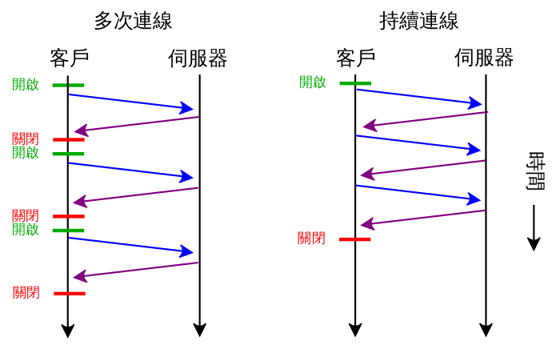

# Http1.0、Http1.1、Http2.0

### http1.1相对于http1.0的区别
* 缓存处理上增加了cache-control，Etag, If-nonce-match等缓存头
* 带宽优化及网络连接的使用。通过请求头中的range，允许只请求资源的一部分，服务器只回应资源的指明部分.在请求成功的情况下，服务器会返回  206 Partial Content 状态码。
* 错误通知的管理
* 默认支持场链接，还支持以[管道方式](https://zh.wikipedia.org/wiki/HTTP%E7%AE%A1%E7%B7%9A%E5%8C%96)在同时发送多个请求，以便降低线路负载，提高传输速度。

### 管道化

### http2.0相比http1.1
* 无须先入先出的多路复用，在一个tcp链接上同时并发多个http请求，相互不影响，解决http1.1线头阻塞的问题
* 二进制分帧，为简化客户端和服务器开发的消息—帧机制
* header头部压缩
* 请求优先级排序
* 服务器推送

### 帧、消息、流和TCP连接
有别于HTTP/1.1在连接中的明文请求，HTTP/2与SPDY一样，将一个TCP连接分为若干个流（Stream），每个流中可以传输若干消息（Message），每个消息由若干最小的二进制帧（Frame）组成。[12]这也是HTTP/1.1与HTTP/2最大的区别所在。 HTTP/2中，每个用户的操作行为被分配了一个流编号(stream ID)，这意味着用户与服务端之间创建了一个TCP通道；协议将每个请求分割为二进制的控制帧与数据帧部分，以便解析。这个举措在SPDY中的实践表明，相比HTTP/1.1，新页面加载可以加快11.81% 到 47.7%[17]

### 参考链接
* [超文本传输协议](https://zh.wikipedia.org/wiki/%E8%B6%85%E6%96%87%E6%9C%AC%E4%BC%A0%E8%BE%93%E5%8D%8F%E8%AE%AE)
* [HTTP2](https://zh.wikipedia.org/wiki/HTTP/2)

