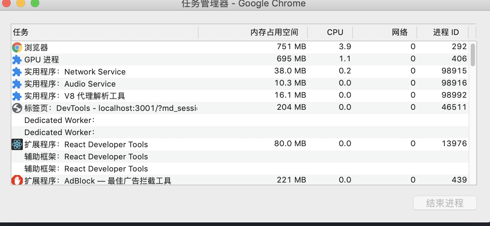

# 浏览器进程和线程
先自上而下弄清楚主体，再针对每个问题来看
### 大纲
* 进程和线程的区别
* 浏览器包含哪些进程
* 输入URL后，用户经过了哪些流程看到界面
* 渲染进程包括哪些线程

### 进程和线程的区别
* 进程是系统分配资源的最小单元，一个进程包含多个线程
* 线程是在进程中运行任务的单位，多个线程之间相互协作，共享同一个进程的内存

### 浏览器包含哪些进程

* 浏览器主进程。负责浏览器界面显示，响应用户交互，创建管理销毁其他进程
* GPU进程，负责3D绘制
* 插件进程：一个插件对应一个进程
* Renderer进程：V8代理解析工具进程，浏览器内核，负责页面渲染，js解析执行。一个tab对应一个
* Audio service进程：音视频进程，chrome 76开始将音视频从浏览器进程转移到了一个单独的进程
* Network service进程：网络进程，负责网络资源的下载和管理

### 输入URL后，用户经过了哪些流程看到界面
主体分为两个流程
* 导航流程
* 浏览器渲染流程

#### 导航流程
导航流程指的是发起URL请求到把内容交给renderer进程处理的过程。包括
* 用户输入URL后，如果输入的是URL，地址栏加上协议后合成新的URL。如何输入的是内容，则会用浏览器的默认搜索引擎来和合成搜索关键字的URL。
* url请求
    * 重定向
    * 根据响应头Content-type类型不同做处理
* 准备渲染进程
* 发出提交文档的指定，告诉渲染进程和网络进程传输数据

#### 渲染流程
* 解析HTML构建DOM树
* 解析css计算和标准化styleSheet。结合DOM树合成render树
* 计算render树中节点的尺寸和位置，进行布局
* 绘制render树
* GPU合成图层信息，显示在屏幕上

### 渲染进程包括哪些线程
* GUI渲染线程
* js引擎线程
* 定时器线程
* 事件触发线程

